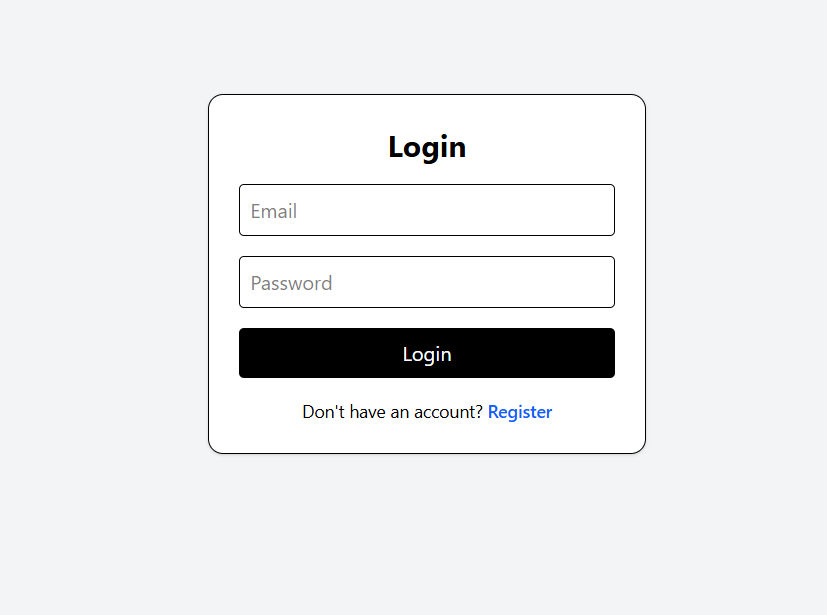
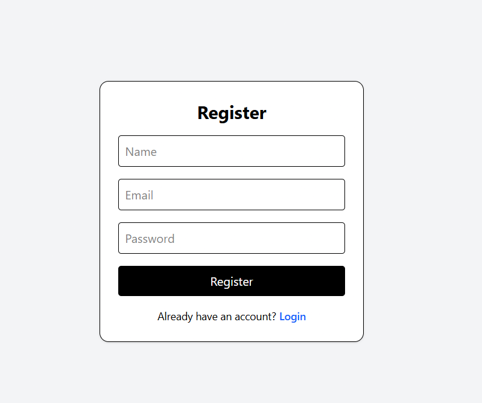
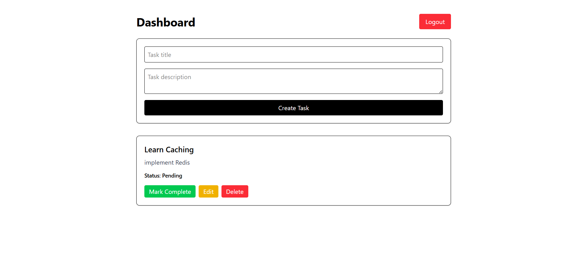
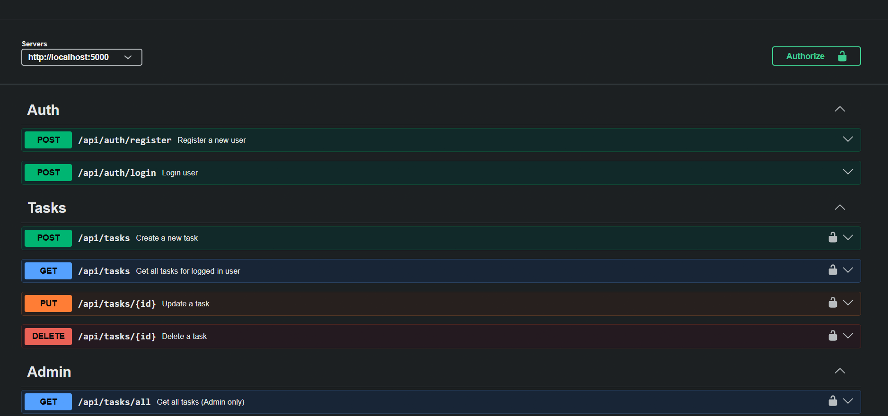
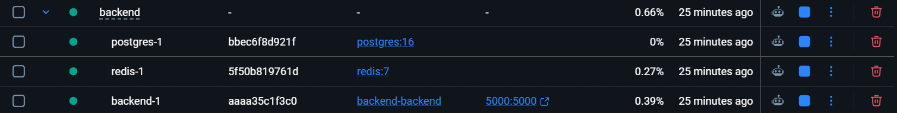

# Task Management System

A full-stack Task Management System built using React, Node.js, Express, TypeScript, Prisma, PostgreSQL, Redis, and Docker.

This project provides secure JWT-based authentication, role-based authorization, task CRUD operations, Redis caching, Swagger API documentation, and Dockerized backend services.

---

# Features

## Authentication & Authorization
- User Registration
- User Login
- JWT Authentication
- Protected Routes
- Role-Based Access Control (RBAC)

---

## Task Management
- Create Tasks
- Update Tasks
- Delete Tasks
- Toggle Task Completion Status
- Fetch User-Specific Tasks
- Admin Route to Fetch All Tasks

---

## Backend Features
- RESTful APIs
- Prisma ORM
- PostgreSQL Database
- Redis Caching
- Cache Invalidation
- Zod Validation
- Swagger API Documentation
- Dockerized Backend Services

---

## Frontend Features
- Login & Register UI
- Protected Dashboard
- Task CRUD Interface
- Task Completion Toggle
- Toast Notifications
- Responsive UI using Tailwind CSS

---

# Tech Stack

## Frontend
- React
- TypeScript
- Tailwind CSS
- Axios
- React Router DOM
- React Hot Toast

---

## Backend
- Node.js
- Express.js
- TypeScript
- Prisma ORM
- PostgreSQL
- Redis
- JWT Authentication
- Zod Validation
- Swagger

---

## DevOps / Tools
- Docker
- Docker Compose
- Git & GitHub

---

# Architecture

```text
Frontend (React)
        ↓
Backend API (Node.js + Express)
        ↓
Redis Cache
        ↓
PostgreSQL Database
```

---

# Project Structure

```bash
task-management-system/
│
├── frontend/
│   ├── src/
│   ├── public/
│   └── package.json
│
├── backend/
│   ├── prisma/
│   ├── src/
│   │   ├── config/
│   │   ├── controllers/
│   │   ├── middlewares/
│   │   ├── routes/
│   │   ├── services/
│   │   ├── validators/
│   │   └── server.ts
│   │
│   ├── Dockerfile
│   ├── docker-compose.yml
│   ├── .env
│   └── package.json
│
└── README.md
```

---

# Environment Variables

Create a `.env` file inside the backend folder.

```env
DATABASE_URL=your_postgresql_database_url

POSTGRES_USER=your_postgres_user
POSTGRES_PASSWORD=your_postgres_password
POSTGRES_DB=your_database_name

JWT_SECRET=your_jwt_secret

REDIS_URL=your_redis_url

PORT=5000
```

---

# Backend Setup

## Clone Repository

```bash
git clone <your-repository-url>
```

---

## Move to Backend Folder

```bash
cd backend
```

---

## Install Dependencies

```bash
npm install
```

---

# Docker Setup

The backend is fully containerized using Docker Compose.

## Start Docker Containers

```bash
docker compose up --build
```

This command starts:
- Backend Server
- PostgreSQL Database
- Redis Server

---

## Run Prisma Migration

Open a new terminal and run:

```bash
docker compose exec backend npx prisma migrate dev
```

---

## Stop Containers

```bash
docker compose down
```

---

## Remove Containers + Volumes

```bash
docker compose down -v
```

---

# Backend Runs On

```bash
http://localhost:5000
```

---

# Frontend Setup

## Move to Frontend Folder

```bash
cd frontend
```

---

## Install Dependencies

```bash
npm install
```

---

## Start Frontend

```bash
npm run dev
```

---

# Frontend Runs On

```bash
http://localhost:5173
```

---

# API Documentation

Swagger documentation is available at:

```bash
http://localhost:5000/api-docs
```

---

# Main API Endpoints

## Authentication APIs

### Register User

```http
POST /api/auth/register
```

### Login User

```http
POST /api/auth/login
```

---

## Task APIs

### Get User Tasks

```http
GET /api/tasks
```

### Create Task

```http
POST /api/tasks
```

### Update Task

```http
PUT /api/tasks/:id
```

### Delete Task

```http
DELETE /api/tasks/:id
```

### Get All Tasks (Admin Only)

```http
GET /api/tasks/all
```

---

# Redis Caching

This project implements Redis caching using the **Cache Aside Pattern**.

## Cached Endpoint
- `GET /api/tasks`

---

## Cache Flow

### First Request
- Data fetched from PostgreSQL
- Stored inside Redis cache

### Subsequent Requests
- Data served directly from Redis
- Reduces database load
- Improves API response time

---

## Cache Invalidation

Redis cache is automatically cleared after:
- Task Creation
- Task Update
- Task Deletion

This ensures users always receive updated task data.

---

# Security Features

- JWT Authentication
- Protected API Routes
- Role-Based Authorization
- Request Validation using Zod
- Environment Variable Protection

---

# Scalability Notes

This project is designed with scalability considerations.

## Redis Caching
Redis caching reduces repeated database queries and improves response times.

---

## Dockerized Architecture
All backend services are containerized using Docker Compose for easier deployment and environment consistency.

---

## Modular Backend Structure
The backend follows a modular architecture with separate:
- Controllers
- Services
- Routes
- Validators
- Middleware

This improves maintainability and scalability.

---

## Future Scalability Improvements

Potential future improvements include:
- Microservices Architecture
- API Gateway
- Load Balancing
- Rate Limiting
- Refresh Token Authentication
- CI/CD Pipeline
- Kubernetes Deployment
- WebSocket Support
- Background Job Queues
- Unit & Integration Testing

---

# Screenshots

## Login Page


---

## Register Page


---

## Dashboard


---

## Swagger API Documentation


---

## Docker Containers Running


---

# Future Improvements

- Dark Mode UI
- Task Categories
- Task Deadlines
- Task Priority Levels
- Search & Filtering
- Email Notifications
- Real-time Updates
- Analytics Dashboard

---

# Author

Akshat Jain

---

# License

This project is created for educational and internship assignment purposes.